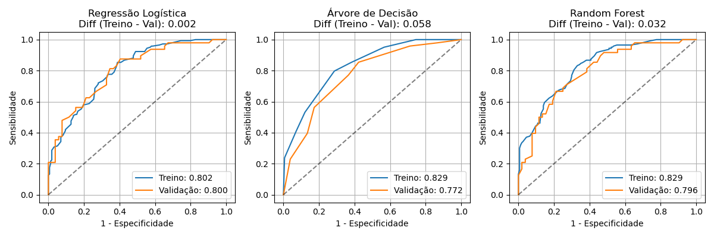
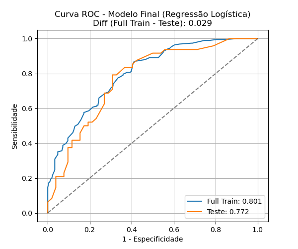
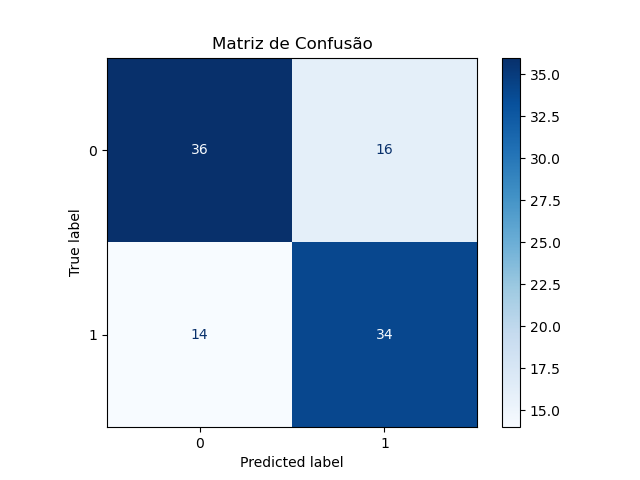

# Car Recall Risk Prediction

## Project Summary

**Goal:** Estimate the probability that a vehicle will be recalled, based on how it has been used (age, mileage) and how many complaints it has received.
**Model:** Logistic Regression (tuned).
**Dataset:** 500 vehicles with 5 raw fields: `modelo` (model), `idade_veiculo` (age in years), `km` (mileage), `reclamacoes` (complaints) and `recall` (target).
**App:** An interactive Streamlit dashboard with KPIs, recall-rate charts, a risk simulator, and a ranking of the riskiest model/year segments.

**Key Results (Test Set):**
- **Accuracy:** 0.700
- **ROC-AUC:** 0.772
- **Decision threshold:** 0.4715 (F1-optimal on validation)

## Exploratory Data Analysis

The target is close to balanced: 52.2% no-recall vs. 47.8% recall, so no resampling or class-weighting was needed. Numeric fields (age, mileage, complaints) fall in sensible ranges with no obvious outliers or typos.

Two findings shaped the feature selection:

- `km` and `idade_veiculo` are strongly correlated, older cars simply have more mileage, so keeping both would add multicollinearity without adding real information. `km` was dropped in favor of `idade_veiculo`.
- `modelo` (car model) was tested against the target with a chi-square test (Chi² = 6.69, p = 0.570). With that p-value the null hypothesis of independence can't be rejected, so there's no statistical evidence that the model itself drives recall risk, and it was left out of the model.

That leaves two predictors for the final model: **vehicle age** and **number of complaints**.

## Model Selection

Three baselines were trained and compared on validation: Logistic Regression, a Decision Tree, and a Random Forest.

<p align="center">
  
</p>

The Decision Tree showed a visible gap between train and validation AUC (overfitting), while Logistic Regression and Random Forest tracked each other closely on ROC-AUC, average precision and max F1, close enough that no model was a clear winner from a single validation split. To settle it, both were re-evaluated with 5-fold cross-validation on the full training set, and the difference between them stayed smaller than each model's own fold-to-fold standard deviation — statistically a tie.

**Logistic Regression was chosen** given the tie: it's simpler, more stable across folds, and far easier to explain to a non-technical audience than a Random Forest, which matters when a decision like "recall this vehicle" needs to be justified.

## Hyperparameter Tuning & Threshold

A grid search over the regularization strength `C` (L2 penalty, optimizing AUC) picked `C = 0.01`, with cross-validated AUC of 0.802, barely different from the untuned baseline, which is expected on a dataset this small.

The classification threshold was chosen by maximizing F1 on the validation set rather than using the default 0.5, since missing a real recall (false negative) is a worse outcome than a false alarm (false positive):

- **Threshold:** 0.4715
- **Precision:** 0.667 · **Recall:** 0.875 · **F1:** 0.757

## Final Model Evaluation (Test Set)

<p align="center">
  
</p>

The ROC-AUC on the held-out test set (0.772) is close to the full-training-set AUC, which is a good sign that the model isn't overfitting despite the small sample.

<p align="center">
  
</p>

At the 0.4715 threshold, the model reaches 70% accuracy with a fairly even trade-off between classes (precision 0.68 / recall 0.71 for the recall class), which fits a model built on just two features.

## Model Interpretation

Converting the logistic regression coefficients back to real units gives an odds ratio per unit increase:

- **Vehicle age:** each extra year multiplies the odds of recall by **1.037** (+3.7%)
- **Complaints:** each extra complaint multiplies the odds of recall by **1.012** (+1.2%)

Comparing the two on the same 0–1 scale, vehicle age is the stronger driver, moving from youngest to oldest car in the dataset raises recall odds by ~33%, versus ~17% for going from zero to the maximum number of complaints. In short: **older cars are the bigger risk signal, complaints add a smaller but still positive push**.

## Limitations

- **Small dataset:** 500 rows split 300/100/100 makes some metrics noisy, and the chi-square test on `modelo` has limited statistical power, "no evidence of a relationship" isn't the same as "no relationship."
- **Few features:** only vehicle age and complaint count are used, so other real-world recall drivers not present in the data can't be captured.
- **No business cost calibration:** the 0.4715 threshold maximizes F1, not an actual cost trade-off between missing a recall and raising a false alarm, in a real fleet the two are not equally expensive.
- **Unverified leakage risk:** the model assumes complaints are recorded *before* the recall decision. If some complaints were actually filed after a recall (as a consequence of it), that would leak target information into a feature.

## Interactive App

`app.py` is a Streamlit dashboard built on top of the same dataset and trained pipeline (`modelo_recall.pkl`):

- General KPIs (fleet size, total complaints, total recalls, average vehicle age)
- Recall rate by model, and how the recall rate evolves by manufacturing year
- A risk simulator: pick a model, year and mileage/complaints, and get a live recall-probability estimate from the trained model
- A ranking table of the riskiest model × year segments

To run it locally:

```bash
pip install -r requirements.txt
streamlit run app.py
```

## Repository Structure

```
├── data/dataset.xlsx            # raw dataset
├── main.ipynb                   # full analysis: EDA, model selection, tuning, interpretation
├── app.py                       # Streamlit dashboard + risk simulator
├── modelo_recall.pkl            # trained Logistic Regression pipeline
├── images/                      # charts generated by the notebook
└── requirements.txt
```